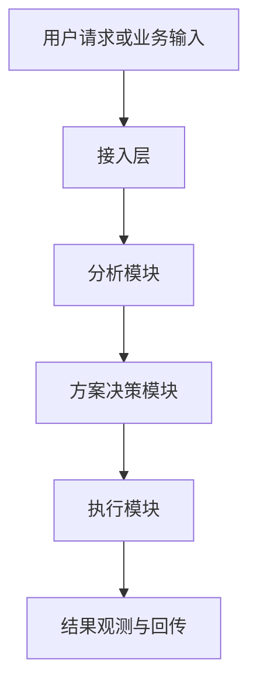
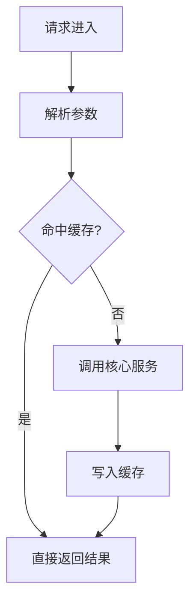

# Mermaid 原理图模板（technical_blog_generator）

> 适用：原文没有可直接复用的图时，用此模板快速生成“技术方案原理图”。
> 要求：仅表达主流程，节点命名简洁，避免堆砌细节。

## 替换指引

1. 将节点名替换为文章中的真实模块名。
2. 若存在关键分支，增加判断节点（菱形）：
   - 例如：`needFallback{是否需要降级}`
3. 若涉及异步或队列，可补充中间节点：
   - `queueLayer[消息队列]`
4. 不确定的流程不要硬画，改为“原文未给出”。

## 常用示例片段

